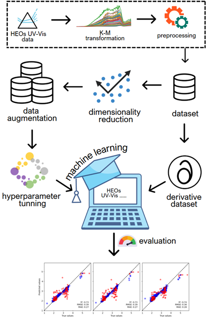

<p align="center">
  
</p>

# Bandgap predictor

Phyton code associated with the methods developed in "A machine learning approach to determine the band gap energy of high entropy oxides using UV-Vis Spectroscopy" by Juan P. Hoyos, Horst Hahn, Shikhar K Jha, Simon Schweidler, and Leonardo Velasco

e-mail: jhoyoss@unal.edu.co or lvelascoe@unal.edu.co 

# Models ML

All the code related to the paper, specifically for building the machine learning models, can be found in ```models_maker.ipynb```, including everything needed to reproduce the results.

## Requirements

Before running the program, make sure you have all dependencies installed. You can do this by running the following command:

```bash
pip install -r requirements.txt
```

## How to Run

```bash
python bandgap_predictor.py
